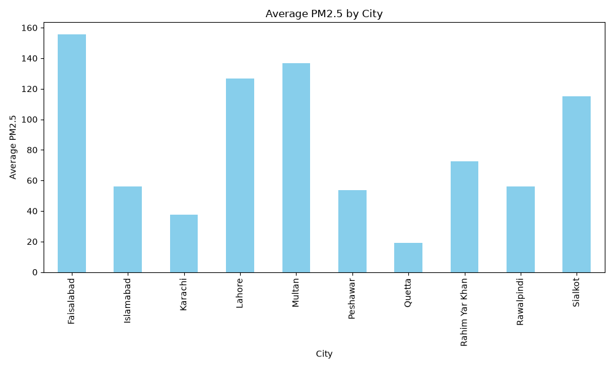

# 🌍 Pakistan Air Quality Dashboard

An end-to-end data science project that monitors, analyzes, and predicts air quality across major cities in Pakistan — combining historical data analysis, machine learning-based prediction, live API-driven monitoring, and an interactive Streamlit dashboard.

---

## 📌 Project Overview

The Pakistan Air Quality Dashboard goes beyond simple visualization — it's a complete pipeline covering **data cleaning, exploratory data analysis (EDA), machine learning model training, live data fetching, and interactive dashboarding**. Users can explore historical trends city-by-city, view real-time air quality pulled from a live API, and see model-driven predictions for key pollutants.

---

## ✨ Features

### 📊 Historical Data Dashboard
- 📍 Filter data by city
- 📅 Filter data by date
- 🌡 Temperature, 💧 Humidity, 🌬 Wind Speed, 📊 Pressure KPI cards
- 🌫 PM2.5, PM10, Dust, ☀️ Ozone monitoring
- 🏷 AQI Category display
- 📈 Interactive Plotly trend charts
- 📋 Filtered data table with 📥 CSV download

### 🔴 Live Air Quality Monitoring
- 🌐 Real-time data fetched via API (`api_keys/fetch_data.py` + `api_keys/config.py`)
- Live readings stored and tracked in `live_air_quality.csv`
- Live KPI cards for pollutants and weather conditions
- Manual refresh + auto-caching for efficient API usage

### 🤖 Machine Learning Prediction
- Trained and compared 3 regression models to predict air quality metrics:

| Model | MAE | RMSE | R² Score |
|---|---|---|---|
| Linear Regression | 22.57 | 28.86 | 0.6778 |
| **Random Forest** ✅ | **15.96** | **23.14** | **0.7929** |
| Gradient Boosting | 18.11 | 24.61 | 0.7657 |

- **Random Forest Regressor** performed best across all three metrics (lowest MAE & RMSE, highest R²) and was selected as the primary prediction model
- Model training and evaluation handled in `src/prediction.py`
- Pretrained models saved in `models/` (`.pkl` files) for fast reuse without retraining

### 📈 Exploratory Data Analysis (EDA)
- Dedicated EDA pipeline (`src/eda.py`) generating saved visual insights in `images/`:
  - Air pollutants percentage breakdown
  - Average PM2.5 by city
  - Dust distribution
  - Humidity vs. Temperature relationship
  - Maximum ozone levels by city
  - PM2.5 distribution by city

### 🎨 UI
- Professional **Sky Blue** theme across background, sidebar, KPI cards, tabs, and charts

---

## 🛠 Technologies Used

| Category | Libraries |
|---|---|
| Dashboard | Streamlit, Plotly |
| Data Handling | Pandas, NumPy |
| Visualization | Matplotlib, Seaborn, Plotly |
| Machine Learning | Scikit-learn, Joblib |
| Live Data / API | Requests |
| Utilities | GitPython, TOML |
| Testing | Pytest |

Full pinned versions are listed in [`requirements.txt`](requirements.txt).

---

## 📂 Dataset

Historical air quality data for major Pakistani cities is stored in `database/`:
- `pakistan_air_quality.csv` — raw dataset
- `cleaned_air_quality.csv` — cleaned dataset (output of `src/cleaning.py`). The raw dataset was already fairly clean, so `cleaning.py` mainly handled minor formatting, type conversion, and consistency checks rather than heavy missing-value or outlier repair.

Live readings are appended to `live_air_quality.csv` at the project root.

### Dataset Columns
- Timestamp, City, Latitude, Longitude
- Temperature, Humidity, Pressure, Wind Speed, Wind Direction
- PM2.5, PM10, Ozone, Dust
- Carbon Monoxide, Nitrogen Dioxide, Sulphur Dioxide
- AQI Category, Season, Date, Month, Year

---

## 📊 Visualizations

Generated EDA visuals (found in `images/`):

| File | Description |
|---|---|
| `air_pollutants_percentage.png` | Share of each pollutant in overall air quality |
| `average_pm25_by_city.png` | Average PM2.5 levels compared across cities |
| `dust_distribution.png` | Distribution of dust levels |
| `humidity_vs_temperature.png` | Relationship between humidity and temperature |
| `maximum_ozone_by_city.png` | Peak ozone levels by city |
| `pm25_distribution_by_city.png` | PM2.5 distribution breakdown by city |

```markdown

```

---

## 🚀 Installation

Clone the repository
```bash
git clone https://github.com/Mehwish-Shafiq/Pakistan-Air-Quality.git
```

Move into the project folder
```bash
cd Pakistan-Air-Quality
```

Install the required libraries
```bash
pip install -r requirements.txt
```

### 🔑 Configure API access (for live data)

Add your API credentials in `api_keys/config.py`, or create a `.streamlit/secrets.toml` file:
```toml
OPENWEATHER_API_KEY = "your_api_key_here"
```

> Never commit real API keys to a public repository — `api_keys/` and `.streamlit/secrets.toml` should be listed in `.gitignore`.

### Run the dashboard
```bash
streamlit run src/app.py
```

### (Optional) Re-run the data pipeline
```bash
python src/cleaning.py        # clean raw data
python src/eda.py             # generate EDA visualizations
python src/prediction.py      # train / run ML models
python api_keys/fetch_data.py # fetch live air quality data
```

---

## 📁 Project Structure

```
Pakistan-Air-Quality/
│
├── api_keys/
│   ├── api_test.py
│   ├── config.py
│   └── fetch_data.py
│
├── database/
│   ├── cleaned_air_quality.csv
│   └── pakistan_air_quality.csv
│
├── images/
│   ├── air_pollutants_percentage.png
│   ├── average_pm25_by_city.png
│   ├── dust_distribution.png
│   ├── humidity_vs_temperature.png
│   ├── maximum_ozone_by_city.png
│   └── pm25_distribution_by_city.png
│
├── models/
│   ├── GradientBoostingRegressor.pkl
│   ├── linear_regression_model.pkl
│   └── RandomForestRegressor.pkl
│
├── src/
│   ├── app.py
│   ├── cleaning.py
│   ├── eda.py
│   ├── prediction.py
│   └── visualization.py
│
├── live_air_quality.csv
├── .gitignore
├── README.md
└── requirements.txt
```

---

## 📈 Future Improvements
- Interactive map visualization of city-wise AQI
- Live AQI prediction using trained ML models directly in the dashboard
- Weekly / monthly trend analysis and forecasting
- Model performance comparison dashboard (RMSE, MAE, R² across models)
- Auto-refresh for live data without manual button click
- Deployment on Streamlit Community Cloud

---

## 🎯 Learning Outcomes
This project helped me gain hands-on experience with:
- Data Cleaning & Preprocessing
- Exploratory Data Analysis (EDA)
- Machine Learning Model Training & Evaluation (Random Forest, Gradient Boosting, Linear Regression)
- Model Serialization (Joblib / Pickle)
- Live API Integration
- Interactive Dashboard Development with Streamlit
- Data Visualization with Plotly, Matplotlib & Seaborn
- Git & GitHub Version Control

---

## 👩‍💻 Author
**Mehwish Shafiq**
BS Data Science
University of Central Punjab (UCP), Lahore
GitHub: https://github.com/Mehwish-Shafiq
LinkedIn: https://www.linkedin.com/in/mehwish-shafiq-155495388/

---

## 📄 License
This project is developed for educational and portfolio purposes.